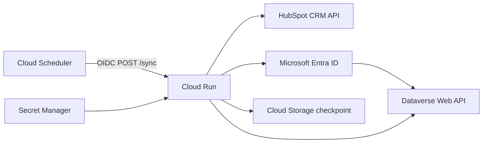

# HubSpot Dynamics 365 Integration

A sanitized portfolio reconstruction of a HubSpot and Microsoft Dynamics 365 / Dataverse integration originally developed in 2025.

The original implementation was built for a private enterprise environment. This repository keeps the integration patterns and technical decisions while removing production credentials, customer data, proprietary field names, and organization-specific business rules.

## What this project covers

The service coordinates CRM synchronization between HubSpot and Dataverse:

- reads contacts from a HubSpot list;
- normalizes contact identity data;
- creates or updates Dataverse contacts;
- detects duplicate/conflicting matches instead of picking one silently;
- creates or updates related Dataverse opportunities using configurable business keys;
- supports an optional Dynamics-to-HubSpot contact synchronization path;
- persists reverse-sync checkpoints in Google Cloud Storage;
- avoids unnecessary writes when values have not changed;
- exposes the workflow through a small Flask service intended for Cloud Run.

The default mode is one-way (`HubSpot -> Dataverse`). Bidirectional contact synchronization must be enabled explicitly.

## Architecture



A more detailed view is available in [docs/architecture.md](docs/architecture.md).

## Synchronization modes

### Forward

`SYNC_MODE=forward` is the default.

```text
HubSpot list
    -> contact batch read
    -> identity normalization
    -> Dataverse contact create/update/conflict
    -> Dataverse opportunity create/update/conflict
```

Contact matching uses normalized email first and mobile phone as a fallback. A contact without either identity value is skipped.

Opportunity matching uses the Dataverse contact plus configurable business keys defined in the mapping file.

### Bidirectional contacts

`SYNC_MODE=bidirectional` enables the reverse contact flow after the forward synchronization.

```text
Cloud Storage checkpoint
    -> changed Dataverse contacts
    -> exclude integration user
    -> HubSpot lookup by normalized email
    -> update / missing / conflict
    -> checkpoint update
```

Reverse synchronization is update-only in this reconstruction. It does not create a HubSpot contact when the Dataverse contact has no existing match.

## Conflict handling

The service avoids arbitrary writes when identity is ambiguous.

Examples:

- more than one Dataverse contact matches an email: `conflict`;
- more than one HubSpot contact matches an email: `conflict`;
- more than one Dataverse opportunity matches the configured identity: `conflict`;
- no HubSpot reverse match: `missing`.

This is deliberate. The integration surfaces ambiguous records instead of silently modifying whichever record the API returns first.

## Configuration

Copy `.env.example` and provide environment-specific values outside version control.

```env
HUBSPOT_ACCESS_TOKEN=
HUBSPOT_LIST_ID=

DYNAMICS_TENANT_ID=
DYNAMICS_CLIENT_ID=
DYNAMICS_CLIENT_SECRET=
DYNAMICS_BASE_URL=https://your-environment.crm.dynamics.com
DYNAMICS_API_VERSION=v9.2

MAPPING_FILE=config/mapping.example.json
SYNC_MODE=forward

CHECKPOINT_BUCKET=
CHECKPOINT_BLOB=checkpoints/reverse-contacts.txt
DYNAMICS_INTEGRATION_USER_ID=
```

`CHECKPOINT_BUCKET` and `DYNAMICS_INTEGRATION_USER_ID` are required only when bidirectional mode is enabled.

## Mapping

The repository includes `config/mapping.example.json` with generic sample fields.

The original enterprise mapping is intentionally not included. Custom Dataverse logical names and business-specific semantics were replaced with fictional examples so the project can demonstrate the mapping approach without exposing the private schema.

## Local development

Python 3.11+ is required.

```bash
python -m venv .venv
source .venv/bin/activate
pip install -e ".[dev]"
pytest
ruff check .
```

On Windows PowerShell:

```powershell
python -m venv .venv
.\.venv\Scripts\Activate.ps1
pip install -e ".[dev]"
pytest
ruff check .
```

Start the service locally:

```bash
flask --app src.app run --debug
```

Endpoints:

- `GET /health` - basic service health check;
- `POST /sync` - executes the configured synchronization workflow.

## Tests and CI

The test suite uses mocks and synthetic records. No production CRM data is included.

The repository tests:

- HubSpot pagination and batch reads;
- Dataverse authentication/client behavior;
- contact normalization and matching decisions;
- opportunity create/update/conflict decisions;
- reverse contact synchronization;
- checkpoint behavior;
- loop-prevention decisions;
- retry policy;
- Dataverse batch reads;
- API endpoint behavior;
- structured logging.

GitHub Actions runs Ruff and pytest on pull requests and pushes to `main`.

## Reliability decisions

A few implementation choices are intentionally conservative:

- safe read requests can retry transient `429` and `5xx` responses;
- create/update requests are not blindly retried because an ambiguous network failure can duplicate a side effect;
- Dataverse batch support is limited to reads in this reconstruction;
- reverse checkpoints advance only after the bounded window completes successfully;
- the first reverse run initializes the checkpoint instead of replaying the entire Dataverse history;
- contact writes are skipped when normalized values are already equivalent.

## Deployment

The intended deployment target is Google Cloud Run with Cloud Scheduler invoking `POST /sync` through OIDC.

Secrets should be stored in Secret Manager and injected at runtime rather than stored in the image or repository. The reverse-sync checkpoint can be stored in a dedicated Cloud Storage bucket.

See [docs/deployment.md](docs/deployment.md) for the deployment layout and example commands.

## Security and sanitization

This repository does not include:

- production HubSpot tokens;
- Microsoft Entra client secrets;
- real tenant/client identifiers;
- real Dataverse environment URLs;
- customer records or PII;
- the original HubSpot list ID;
- proprietary Dataverse custom field names;
- the original enterprise mapping file;
- internal organization names or business process documentation.

The historical private implementation is intentionally kept separate from this repository.

## Current scope and limitations

This is not a generic commercial synchronization platform. It is a focused reconstruction of an integration pattern I implemented in a private enterprise environment.

Current limitations include:

- reverse synchronization covers contacts only;
- reverse identity uses normalized email only;
- automatic latest-update-wins conflict resolution is not implemented;
- the checkpoint does not provide a distributed lock;
- the service does not claim exactly-once delivery semantics;
- organization-specific mapping and validation rules are intentionally absent.

## Project provenance

The original enterprise integration was developed in 2025. This repository is a later clean-room portfolio reconstruction based on the original implementation and technical documentation, with proprietary business logic, credentials, customer data, and organization-specific schema removed.
