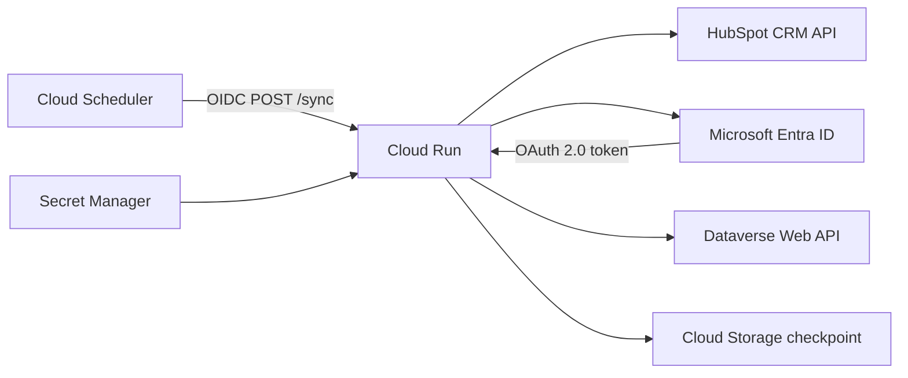
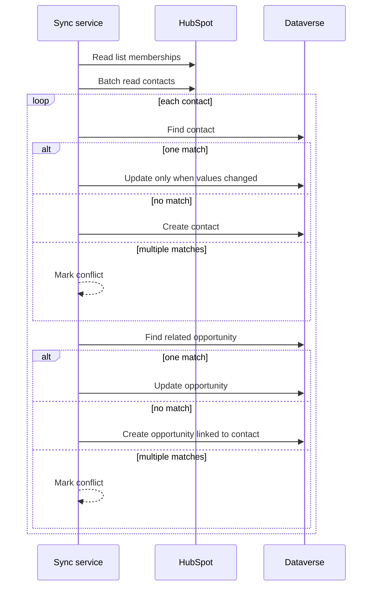
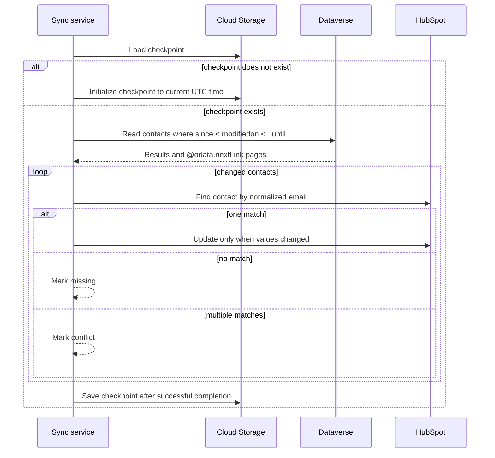

# Architecture

## Overview

This service synchronizes contact data between HubSpot and Microsoft Dynamics 365 / Dataverse. The forward flow also maintains a related Dataverse opportunity using configurable business keys.

The repository is a sanitized portfolio reconstruction of an enterprise integration originally developed in 2025. Organization-specific schema, credentials, customer data, and proprietary business rules are intentionally not included.

## Runtime

Cloud Run is intended to remain private. Cloud Scheduler invokes the service with an OIDC identity that has permission to call the Cloud Run service.

## Forward flow

`SYNC_MODE=forward` is the default.

### Contact identity

Forward contact matching uses normalized email first and normalized mobile phone as a fallback. Multiple matches are reported as a conflict instead of choosing a record arbitrarily.

A contact with neither identity value is skipped.

### Opportunity identity

Opportunity matching uses the Dataverse contact plus configurable business keys. The sample mapping uses fictional field names; the original organization-specific custom fields are not part of this repository.

## Reverse contact flow

`SYNC_MODE=bidirectional` adds the Dynamics-to-HubSpot contact flow after the forward synchronization.

The reverse flow is intentionally update-only. A Dataverse contact that does not already exist in HubSpot is reported as `missing`; this implementation does not create it automatically.

## Loop prevention

The bidirectional flow uses several controls:

- changes made by the Dataverse integration Application User are excluded through `_modifiedby_value`;
- contact values are normalized and compared before sending a PATCH;
- reverse reads use a bounded `since` / `until` window;
- the checkpoint advances only after the reverse window completes successfully;
- the first bidirectional run initializes the checkpoint instead of replaying the entire Dataverse history.

These controls reduce feedback loops and replay. The service does not claim exactly-once processing or distributed transaction semantics.

## Authentication

### HubSpot

HubSpot access uses a private-app bearer token supplied through configuration. List membership and contact reads use the CRM/List APIs with pagination and batch reads.

### Dataverse

Dataverse authentication uses Microsoft Entra ID and the OAuth 2.0 client credentials flow. The service requests the Dataverse `<environment>/.default` scope and calls the Web API using a configurable API version (`v9.2` by default).

A Dataverse Application User with a minimally scoped security role is the expected production pattern.

## Mapping

`config/mapping.example.json` contains a generic opportunity mapping. It supports:

- source and target property names;
- required fields;
- target entity and ID field;
- opportunity business keys;
- contact binding field.

The example intentionally does not reproduce the original proprietary schema.

## Reliability

The HTTP layer uses explicit timeouts and bounded retries for safe read operations on transient responses such as `429` and common `5xx` errors.

Writes are not retried blindly. Replaying a create request after an ambiguous network failure can duplicate a side effect if the upstream system processed the first request but the client did not receive the response.

Dataverse `$batch` support in this reconstruction is limited to reads. Dataverse batch writes require multipart ChangeSets and are intentionally kept separate.

Application logs are structured JSON and avoid contact emails, phone numbers, access tokens, client secrets, and raw CRM payloads.

## Current limits

- Reverse synchronization covers contacts, not HubSpot deals / Dataverse opportunities.
- Reverse contact identity uses normalized email only.
- Conflict handling reports ambiguity instead of applying an automatic latest-update-wins rule.
- The checkpoint store does not provide a distributed lock.
- The service is not an exactly-once event-processing system.

For a single scheduled deployment, limiting Cloud Run concurrency and maximum instances reduces the chance of overlapping synchronization runs. A concurrent or horizontally scaled version should add a transactional lock or lease around the bidirectional workflow.
